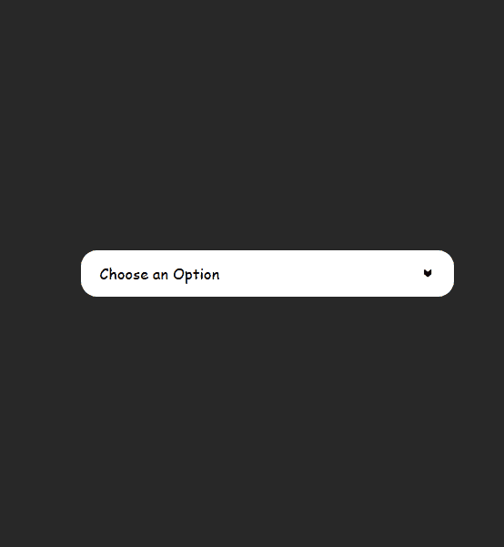

# **Dropdown Component**

A simple, customizable dropdown component built using JavaScript, allowing easy integration and expansion. This component provides a clean UI and dynamic behavior for dropdown menus, supporting user interaction with data selection and state management.

<div align="center">
    
</div>

## Table of Contents

- [Features](#features)
- [Installation](#installation)
- [Usage](#usage)
- [Contributing](#contributing)
- [Credits & Contact](#credits--contact)

## Features

- **Dynamic Options**: Supports dynamic data for dropdown options, easily updated by passing an array.
- **Icon Support**: Integrates smooth animations with icons sourced from Iconify.
- **State Management**: Tracks the open/close state of the dropdown with toggle functionality.
- **Active Item Highlight**: Highlights the selected item and updates the title accordingly.
- **Customizable**: Easily styleable through CSS classes for customization.
- **Event Listener Support**: Listens for option selection, triggering a callback for external actions.

## Installation

### To integrate the Dropdown component into your project, follow these steps:

1. **Clone or Download**: Clone or download the repository to your local machine.
2. **Serve the `index.html` File**: To view the component in action, you’ll need to run a local server. Here are a few options:

   - **Using Live Server**: If you're using Visual Studio Code, you can install the [Live Server extension](https://marketplace.visualstudio.com/items?itemName=ritwickdey.LiveServer). Simply open the `index.html` file and click on "Open with Live Server."

   - **Using XAMPP**: Download and install [XAMPP](https://www.apachefriends.org/index.html). Move the project folder to the `htdocs` directory, then start the Apache server from the XAMPP Control Panel. Access the slider via `http://localhost/your-folder-name/index.html`.

   - **Using Python**: If you have Python installed, navigate to your project directory in the terminal or command prompt and run:
     ```bash
     python -m http.server
     ```
     This will start a simple HTTP server, which you can access at `http://localhost:8000/index.html`.

## Usage

### Dropdown Configuration Parameters:

- **A list**: An array of dropdown items (strings).
- **Listener**: A callback function that receives the selected item.

### Example Use Case:

Here’s an example of how you can integrate the `dropdown` component into your project:

1. Import the **dropdown** component in a javascript file.

```javascript
import { DropDown } from "./Widget/dropdown.js";
```

2. Create and append the dropdown:

```javascript
// Define dropdown items
const dropdownItems = [
  "Option 1",
  "Option 2",
  "Option 3",
  "Option 4",
  "Option 5",
  "Option 6",
  "Option 7",
  "Option 8",
  "Option 9",
  "Option 10",
];

//  Create the dropdown
const DD = DropDown(
  //
  dropdownItems,
  //
  (selectedItem) => {
    handleSelection(selectedItem);
  }
  //
);

// Handle selection
function handleSelection(item) {
  console.log(`the selected item is : ${item}`);
}

// Append dropdown to the DOM
document.body.appendChild(DD);
```

## CSS Customization

You can customize the component's appearance by overriding the following classes:

 - `.DD` - Dropdown container
 - `.DDTitle` - Title section of the dropdown
 - `.DDIcon` - Icon inside the title
 - `.DDBody` - Container for dropdown options
 - `.DDItem` - Individual dropdown item
 - `.active` - Class applied to the selected item

## Contributing

**_Contributions are welcome!_**

## Credits & Contact

**Creator**: Subhaan Yaghouti

**Contact**: If you have any questions or feedback, feel free to reach out via [yaghouti.1831@gmail.com](mailto:yaghouti.1831@gmail.com) or on Instagram [@subhaan_yaghouti](https://www.instagram.com/subhaan_yaghouti?igsh=bmE3ZTl1bGkwaW50).
